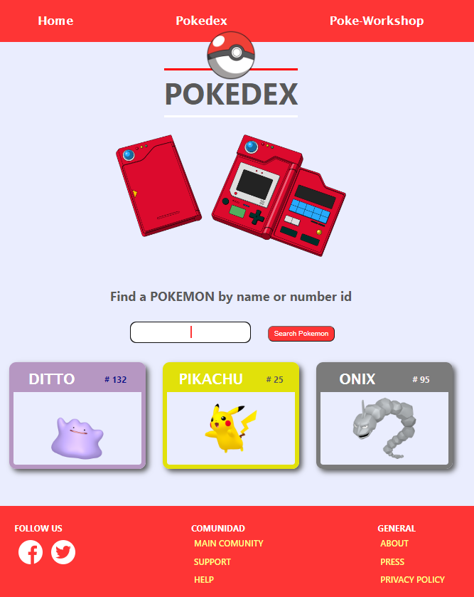
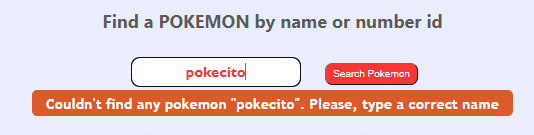
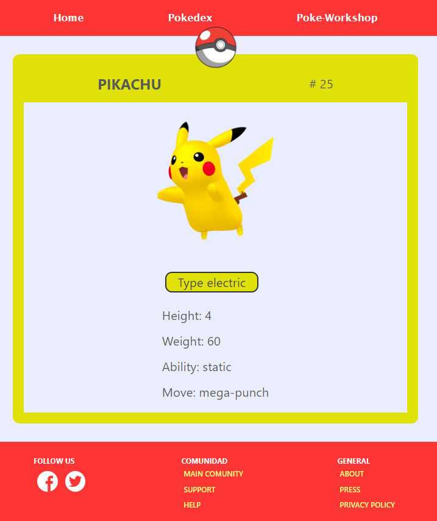
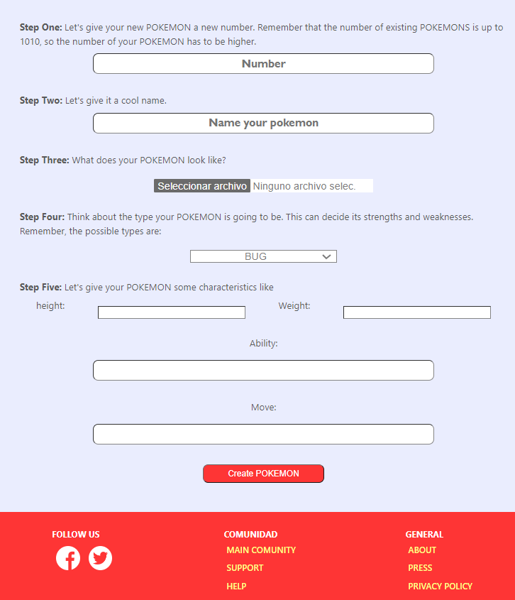
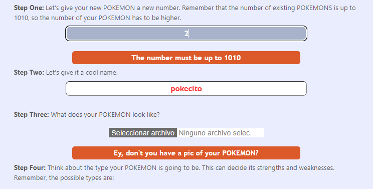
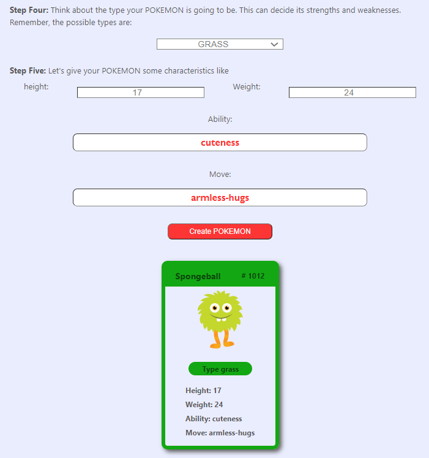
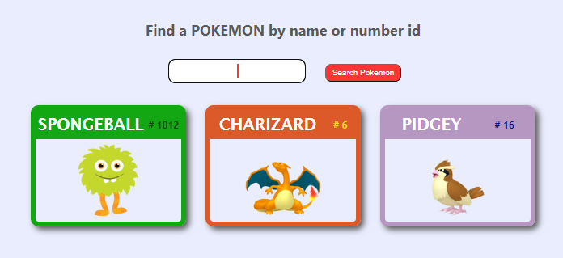

# React-Pokemon Appweb Exercise

This is a front-end application built with React that focuses on displaying and interacting with Pokemon data. The application utilizes various React hooks such as `useParams`, `useContext`, `useState`, `useEffect`, and `useForm` from the "react-hook-form" library.

## Features

The React Pokemon App includes the following features:

### Routing

The application uses React Router DOM for routing and rendering different views. The following routes are available:

- **Home**: This route displays a welcome message to the user along with an autoplay YouTube video of the original Pokemon series. It uses the `ReactPlayer` component from the "react-player" library to embed the video.

- **Pokedex**: This route allows users to search for any Pokemon by name or ID number. 

It fetches data from the Pokeapi (https://pokeapi.co/) and displays the search results in cards. Clicking on a Pokemon's name in the card will render a new view with detailed information about that Pokemon in a larger card.

- **Poke-Workshop**: This route contains a form that allows users to create a new Pokemon by providing various inputs.

The form handles validation and regex-based error checking using `useForm`.
 
 

Once submitted, the form creates a new card or multiple cards, which can be clicked on to display detailed information. 
  
  
  
The new Pokemon is automatically saved and rendered in the Pokedex.

